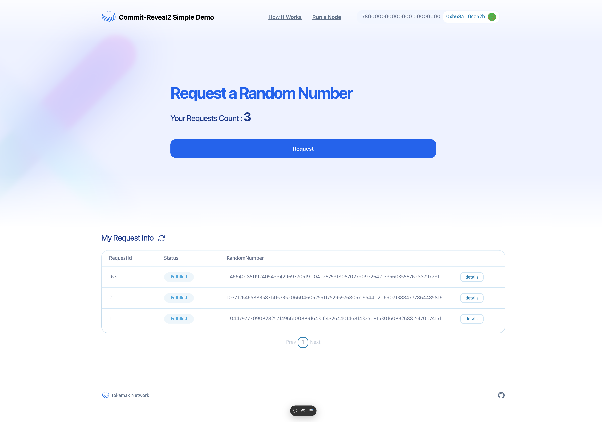

<!--
 Copyright 2023 justin
 
 Licensed under the Apache License, Version 2.0 (the "License");
 you may not use this file except in compliance with the License.
 You may obtain a copy of the License at
 
     http://www.apache.org/licenses/LICENSE-2.0
 
 Unless required by applicable law or agreed to in writing, software
 distributed under the License is distributed on an "AS IS" BASIS,
 WITHOUT WARRANTIES OR CONDITIONS OF ANY KIND, either express or implied.
 See the License for the specific language governing permissions and
 limitations under the License.
-->
# Commit-Reveal² Demo

A demonstration repository for the Commit-Reveal² protocol, showcasing how it simplifies secure and fair randomness generation for blockchain systems. This demo allows you to interact with the protocol by connecting your MetaMask wallet, requesting random numbers, and viewing transaction details. Additional resources, such as a guide on running a node and an explanation of the protocol, are also included to help you get started quickly.

You can test the application on the **Thanos-Sepolia** network by visiting [rng-demo.vercel.app](https://rng-demo.vercel.app/).

# Getting Started
## Requirements

- [git](https://git-scm.com/book/en/v2/Getting-Started-Installing-Git)
  - You'll know you did it right if you can run `git --version` and you see a response like `git version x.x.x`
- [Nodejs](https://nodejs.org/en/)
  - You'll know you've installed nodejs right if you can run:
    - `node --version` and get an ouput like: `vx.x.x`
- [Yarn](https://yarnpkg.com/getting-started/install) instead of `npm`
  - You'll know you've installed yarn right if you can run:
    - `yarn --version` and get an output like: `x.x.x`
    - You might need to [install it with `npm`](https://classic.yarnpkg.com/lang/en/docs/install/) or `corepack`


## QuickStart
```
git clone https://github.com/tokamak-network/Commit-Reveal2-SimpleDemo.git
cd Commit-Reveal2-SimpleDemo
yarn
yarn run dev
```

## Formatting in VSCode

To have VSCode extension prettier auto-format `.jsx` and `.tsx`, add the following to your settings.json file:

```
  "[typescriptreact]": {
    "editor.defaultFormatter": "esbenp.prettier-vscode"
  },
  "[javascriptreact]": {
    "editor.defaultFormatter": "esbenp.prettier-vscode"
  }
```

## Usage



- **Connect MetaMask**: Use your MetaMask wallet to interact with the application.
- **Request Random Number**: Click the **Request** button to test the protocol and generate a random number.
- **View Request Info**: Check your requests and their statuses in the **My Request Info** section.
  - Click the **Details** button to view transaction and operator details.
- **Additional Pages**:
  - **How It Works**: Learn about the Commit-Reveal² protocol.
  - **Run a Node**: Instructions for running your own node.

## Learn More

- **Commit-Reveal² Protocol**: [Explore the Protocol Manuscript](#)

## Contributing

Contributions are welcome! Feel free to open issues or submit pull requests to improve this demo.